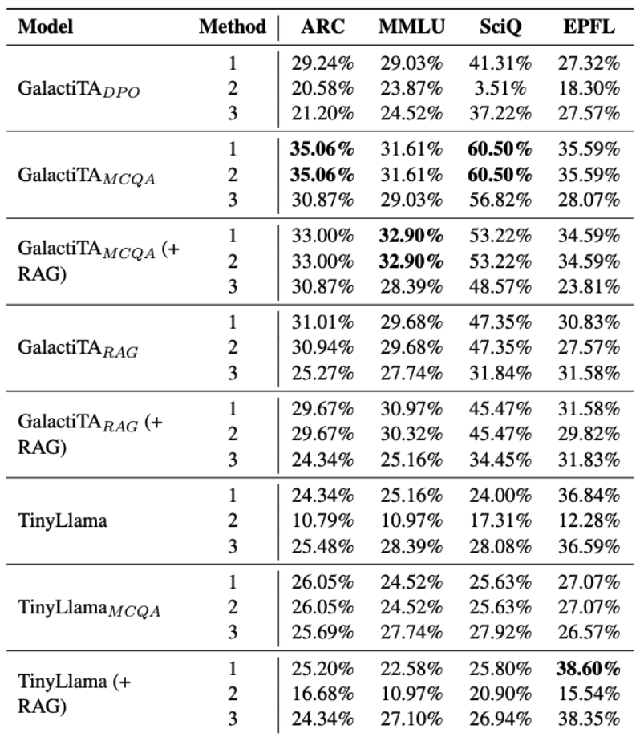

# GalactiTA: AI-Driven Solutions for Scientific Question Answering
This project is a part of Modern Natural Language Processing (CS-552) course at EPFL.

### Project Overview: GalactiTA

**GalactiTA** is a domain-specific digital teaching assistant (TA) designed to tackle **Multiple Choice Questions (MCQs)** in Science, Technology, Engineering, and Mathematics (STEM) disciplines. The project focuses on adapting large language models (LLMs) to improve the accuracy of responses in scientific question-answering tasks. This initiative was developed in response to the demand for more specialized models tailored to educational environments like EPFL. The model helps both students and teaching assistants (TAs) by answering complex technical questions, providing improved assistance for educational purposes.

### Key Features:

- **Model:** Fine-tuned from the **Galactica-1.3B** model to improve performance in answering scientific MCQs.
- **Optimization:** Utilizes **Direct Preference Optimization (DPO)** to align the model's output to match user expectations more closely.
- **Retrieval-Augmented Generation (RAG):** The system is enhanced using **Retrieval-Augmented Generation**, integrating external scientific knowledge sources to deliver more accurate answers.
- **Data Sources:** Key datasets include **ScienceQA, SciQ, and a custom EPFL dataset**. These are used to fine-tune the model for responding to MCQs.
- **Accuracy Improvement:** The use of RAG improves performance by **11.52%** on the custom EPFL dataset.

### Workflow

1. **Data Collection:** The project leverages datasets like **ScienceQA** and **SciQ**, adding explanations to train the model in providing not just answers but also reasoning using Chain-of-Thought (CoT) methodology. External documents from textbooks and scientific papers are integrated for the RAG setting.
   
2. **Training Steps:**
The training steps is shown in the figure below:

   - **Supervised Fine-Tuning (SFT):** The Galactica-1.3B model is fine-tuned to respond to scientific questions.
   - **Direct Preference Optimization (DPO):** The model is optimized to align with preferred responses using a dataset that pairs good and bad responses.
   - **RAG-Tuning:** The model is further trained to incorporate external documents into its answers, leading to improved accuracy.

3. **Evaluation:** The model's performance is evaluated using multiple automatic metrics (token distribution, greedy decoding, and option probability sum methods) across datasets like ARC, MMLU, SciQ, and EPFL.

### Model Accuracy

The results demonstrate significant improvements in accuracy, particularly on the custom EPFL dataset where RAG-tuning provides an **11.52% increase**. The model is also compared with other approaches, such as the **TinyLlama** model, and shows competitive results, especially in RAG-based evaluations.

### Availability
The models trained during the project has been open sourced on [HuggingFace](https://huggingface.co/):
   - `Jakh0103/new_galactica-1.3b_0.1beta_ai` - the model trained with SFT and optimized with DPO alignment method (training steps 1 and 2)
   - `Jakh0103/new_galactica-1.3b_mcq_rag` - the model trained with RAG (training step 3)

*Please refert ot the [report](pdfs/report.pdf) for full details of the project*